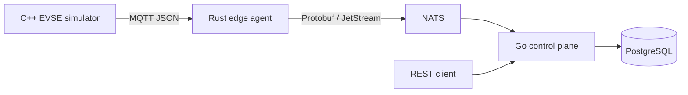

# ORVOLT

ORVOLT is an edge-first, production-oriented foundation for EV charging infrastructure telemetry. This milestone implements one local data path:



The simulator is fictional. It does not control physical equipment and does not implement or claim EV charging protocol compliance.

The control plane also accepts future authorized external-energy observations on `orvolt.energy.site.v1`. The first planned provider is an SMA sandbox adapter; it is not connected until approved OAuth credentials and sanctioned fixtures are available.

## Quick Start

Prerequisites for the container workflow: Docker Compose. For local builds: CMake plus a C++20 compiler, Rust, Go, Buf, and `protoc` (Buf provides the latter during generation).

```sh
cp .env.example .env
make bootstrap
make build
make test
make up
curl http://localhost:8080/health
curl http://localhost:8080/api/v1/stations
make down
```

`make up` starts the broker, event bus, database, edge agent, control plane, and simulator. `make simulate` runs only the simulator against an already-running MQTT broker.

## Repository

| Directory | Responsibility |
| --- | --- |
| `contracts/` | Versioned Protocol Buffer schemas and generation configuration. |
| `simulator/evse-simulator/` | Synthetic MQTT telemetry publisher. |
| `edge/orvolt-edge-agent/` | MQTT validation and canonical NATS JetStream publishing. |
| `cloud/control-plane/` | JetStream consumer, PostgreSQL projection, REST management API. |
| `integrations/energy/` | Documented future cloud adapters for authorized energy-provider data. |
| `firmware/safety-controller/` | Documented future fail-safe hardware protection boundary. |
| `power/power-controller/` | Documented future converter-control boundary. |
| `protocols/` | Adapter boundaries for future standards-compliant integrations. |
| `docs/` | Architecture decisions and detailed boundary design. |

## API

- `GET /health`
- `GET /ready`
- `GET /api/v1/stations`
- `GET /api/v1/stations/{stationId}`
- `GET /api/v1/stations/{stationId}/telemetry/latest`
- `GET /api/v1/energy/sites/{siteId}/latest`

## Development Notes

`contracts/proto` is the canonical schema source. Rust bindings are generated at build time using a vendored `protoc`; Go bindings are generated reproducibly by `buf generate` before local builds and by `protoc-gen-go` during the container build. Do not edit generated files.

See [system overview](docs/architecture/system-overview.md), [data flow](docs/architecture/data-flow.md), and [security boundaries](docs/architecture/security-boundaries.md).

External energy providers are deliberately not connected in this milestone. Their cloud-only boundary, consent model, and public-source assessment are documented in [external energy integrations](docs/architecture/external-energy-integrations.md).
