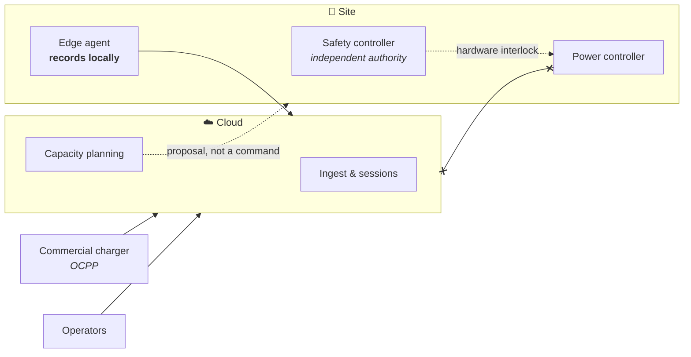

<div align="center">

# ORVOLT

### Charging infrastructure that assumes the network will fail

[](https://github.com/maykonlincolnusa/ORVOLT/actions/workflows/ci.yml)
[](LICENSE)

</div>

---

A charger is not a server.

It sits in a basement car park behind a modem that drops for minutes at a time.
It boots without knowing what time it is. It measures energy that becomes
somebody's invoice, and when it fails, a person is standing in front of it.

Most charging platforms are written as if none of that were true. ORVOLT is
written as if all of it were.

---

## Three commitments

**Losing the cloud costs visibility, never safety.**
Electrical protection lives in hardware with independent authority. No path
exists from the internet to the power controller, and none may be added.

**Losing the network costs latency, never a kilowatt-hour.**
The charger records locally and delivers when it can. A reading that was taken
is a reading that arrives.

**Nothing claims to be more finished than it is.**
Every capability below is marked as implemented or not. A check that has never
run is treated as a failing check.

---

## How it fits together



Chargers reach ORVOLT two ways, and both produce the same events — nothing
downstream knows which one a reading came from.

**Hardware you build** runs the [edge agent](edge/packaging/README.md): one
static binary, supervised by `systemd`, buffering to local flash through an
outage.

**Hardware you buy** connects to the [OCPP gateway](cloud/ocpp-gateway/README.md)
over a WebSocket. Point a charger at it and it works.

---

## Where it stands

| | |
| --- | --- |
| Telemetry, end to end | ✅ Implemented |
| Guaranteed delivery through an outage | ✅ Implemented |
| OCPP 1.6J core profile | ✅ Implemented |
| Charging sessions and energy accounting | ✅ Implemented |
| Device identity, enforced on ingest | ✅ Implemented |
| Site capacity planning | ✅ Implemented — advisory output only |
| Energy provider clients (SMA, Enphase, SolarEdge) | ⏳ Contract ready, no client yet |
| Authorization service for charge tokens | ❌ Not implemented — tokens refused by default |
| Management API authentication | ❌ Not implemented |
| OCPP 2.x, ISO 15118 | ❌ Not implemented |
| Safety and power controllers | 🚫 Reserved boundaries, deliberately not code |
| OCPP, IEC or hardware certification | 🚫 Not claimed |

The included simulator is synthetic. It controls nothing.

---

## Try it

```sh
cp .env.example .env
docker compose up --build
curl localhost:8080/api/v1/stations
```

Then cut the link and watch nothing get lost:

```sh
docker compose stop nats     # the cloud disappears
sleep 30                     # the charger keeps recording
docker compose start nats    # everything buffered arrives
```

---

## Read further

| | |
| --- | --- |
| [Architecture](docs/architecture/system-overview.md) | Trust and failure domains |
| [Decisions](docs/adr/) | Why the system is shaped this way |
| [Device identity](docs/architecture/device-identity.md) | How a charger proves who it is |
| [Running on a charger](edge/packaging/README.md) | And why Kubernetes does not belong there |
| [Running the cloud](infra/k8s/README.md) | And when an orchestrator earns its cost |
| [Verification](docs/verification.md) | What is checked, and what still is not |
| [AGENTS.md](AGENTS.md) | The rules any contributor works within |

---

> ⚠️ Software in this repository must not be connected to real high-voltage
> equipment without appropriate hardware engineering, protection systems,
> validation and certification.

<div align="center">
<sub>Apache-2.0</sub>
</div>
