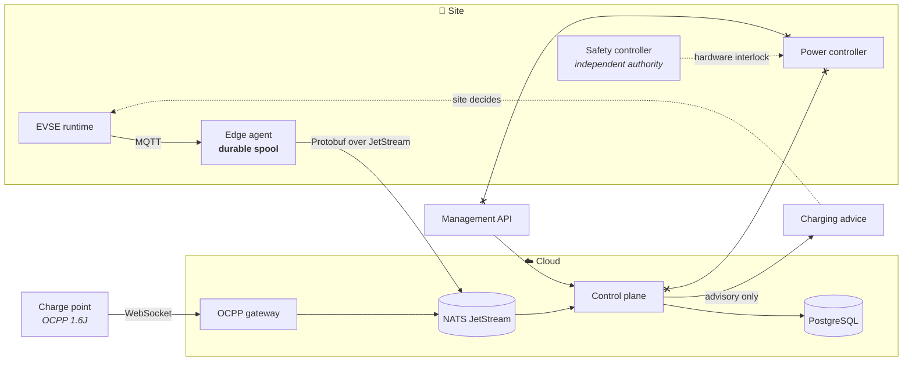

# ORVOLT

**Edge-first infrastructure for EV charging networks.** Telemetry, charging
sessions and site load management, built so that losing the cloud degrades
visibility — never safety, and never a kilowatt-hour of billing evidence.

[](https://github.com/maykonlincolnusa/ORVOLT/actions/workflows/ci.yml)
[](LICENSE)

---

## The idea

A charger is not a server. It sits in a basement car park behind an LTE modem
that drops for minutes at a time, boots without knowing what time it is, and
measures energy that becomes somebody's invoice. Most platforms are written as
if none of that were true.

ORVOLT is written as if all of it were.



Two things that diagram is asserting, both of which the code enforces:

**Nothing in the cloud can reach the power path.** The safety controller holds
independent hardware authority. Charging advice is a *proposal* the site is free
to ignore.

**The edge does not depend on the cloud to keep working.** It validates and
records locally, and delivers when it can.

---

## What is real, and what is not

Most infrastructure READMEs describe an intention. This table describes the
repository.

| Capability | Status |
| --- | --- |
| Telemetry: EVSE → edge → JetStream → PostgreSQL → REST | **Implemented**, end-to-end tested in CI |
| Store-and-forward on the charger, surviving restart and power loss | **Implemented**, with tests |
| OCPP 1.6J core profile (`BootNotification`, `StatusNotification`, `MeterValues`, `Start`/`StopTransaction`, `Heartbeat`, `Authorize`) | **Implemented** |
| Charging sessions and energy accounting from meter registers | **Implemented** |
| Device identity enforced on ingest | **Implemented** |
| Site load management (capacity, solar surplus, fair allocation) | **Implemented**, advisory output only |
| External energy providers (SMA, Enphase, SolarEdge, Tesla) | Contract and ingest ready; **no provider client** — awaits sandbox credentials |
| Authorization service for charge tokens | **Not implemented.** The gateway refuses every token by default |
| Authentication on the management API | **Not implemented** |
| OCPP 2.0.1 / 2.1, ISO 15118 | **Not implemented** |
| Safety controller, power controller | **Deliberately not implemented.** Reserved boundaries, see below |
| OCPP certification, IEC or hardware compliance | **Not claimed** |

The simulator is synthetic. It does not control physical equipment.

---

## Quick start

```sh
cp .env.example .env
docker compose up --build

curl localhost:8080/ready
curl localhost:8080/api/v1/stations
curl localhost:8080/api/v1/stations/orvolt-sim-001/telemetry/latest
curl localhost:8080/api/v1/sites/site-dev-001/charging-advice
curl localhost:9090/metrics        # the edge agent's own view of itself
```

Watch the spool do its job:

```sh
docker compose stop nats           # cut the cloud link
sleep 30                           # the charger keeps recording
docker compose start nats          # everything buffered is delivered
```

Without Docker, `make build && make test` needs CMake with a C++20 compiler,
Rust, Go and Buf. CI runs all of it on every push.

---

## Two ways in

ORVOLT accepts chargers through either path, and both produce the same canonical
events — nothing downstream knows which one a reading came from.

**The edge agent** runs *on* the charger. Use it for hardware you build or
control. It is a single static binary that survives outages by writing to a
local spool. See [edge/packaging/](edge/packaging/README.md).

**The OCPP gateway** runs in the cloud and accepts charge points that speak
OCPP 1.6J over a WebSocket. Use it for hardware you buy. Point a charger at
`ws://host:8887/ocpp/<chargePointId>` and it works. See
[cloud/ocpp-gateway/](cloud/ocpp-gateway/README.md).

---

## Design decisions worth knowing

**Device clocks are not trusted.** Chargers boot without an RTC and before NTP
converges. Every projection and ordering decision uses a control-plane arrival
stamp; the device's own timestamp is kept as an observation and labelled with
whether it can be believed. A station reporting the year 2099 cannot pin itself
as "latest" forever.

**The spool is the product.** The edge agent writes to a CRC-checked, bounded,
segmented log on local flash and advances its cursor only after the cloud
confirms. A crash replays a few records; ingest is idempotent, so replay is
harmless and loss is not.

**Identity comes from the subject, not the payload.** Devices publish to
`orvolt.telemetry.evse.v1.<edge-id>`. The broker enforces which subjects a
credential may use, and the control plane rejects any payload whose claimed
identity disagrees. See [device-identity.md](docs/architecture/device-identity.md).

**Card numbers never land in the database.** An OCPP `idTag` is usually an RFID
number that identifies a person and can be cloned. Only a keyed hash is stored.

**Streams are bounded, sessions outlive telemetry.** An unbounded JetStream store
fills the broker's disk and stops the entire fleet. Sessions are billing
evidence and get their own stream with far longer retention, so the high-volume
telemetry policy can never evict an invoice.

**A share too small to charge with is not offered.** Below roughly 1.4 kW a
vehicle stops accepting charge, so the load manager pauses connectors rather
than trickling every car with an amount that delivers nothing.

**Missing data reduces the proposal, never increases it.** A stale or absent
energy reading falls back to a conservative limit. A provider outage costs
optimisation, not safety margin.

**Kubernetes runs the cloud, `systemd` runs the charger.** An orchestrator on a
1 GB controller behind an LTE link is overhead that assumes a reachable API
server; the real fleet problem is A/B firmware updates with rollback. Both
positions are argued in [infra/k8s/](infra/k8s/README.md) and
[edge/packaging/](edge/packaging/README.md).

---

## Repository

| Directory | Responsibility |
| --- | --- |
| [`contracts/`](contracts/) | Versioned Protobuf schemas. The single source of truth for every wire message. |
| [`edge/`](edge/) | Rust agent: validation, durable spool, delivery. Plus systemd packaging. |
| [`cloud/control-plane/`](cloud/control-plane/) | Go: ingest, persistence, projections, load management, management API. |
| [`cloud/ocpp-gateway/`](cloud/ocpp-gateway/) | Go: OCPP 1.6J central system. |
| [`simulator/`](simulator/) | C++20 synthetic telemetry publisher. Never a physical runtime. |
| [`infra/`](infra/) | Compose for local work, Kubernetes for the cloud. |
| [`docs/`](docs/) | ADRs and architecture notes. |
| [`firmware/`](firmware/), [`power/`](power/) | **Reserved boundaries. Not implemented, and not to be replaced by application software.** |

---

## Management API

| Endpoint | Purpose |
| --- | --- |
| `GET /health`, `GET /ready` | Liveness and dependency readiness |
| `GET /metrics` | Prometheus exposition |
| `GET /api/v1/stations?limit=&after=` | Paginated fleet listing |
| `GET /api/v1/stations/{id}` | One station and its connectors |
| `GET /api/v1/stations/{id}/telemetry/latest` | Newest reading by arrival order |
| `GET /api/v1/sessions?station=&open=true` | Charging sessions |
| `GET /api/v1/sessions/{id}` | One session with delivered energy |
| `GET /api/v1/fleet/silent-stations?threshold=5m` | Chargers that went dark |
| `GET /api/v1/energy/sites/{id}/latest` | Newest external energy observation |
| `GET /api/v1/sites/{id}/charging-advice` | Advisory capacity allocation |

The API is currently **unauthenticated**. Do not expose it to an untrusted
network.

---

## Safety

`firmware/` and `power/` are boundaries, not code, and that is deliberate.

- A loss of the cloud, the bus, the broker or the internet must never remove
  local protective behaviour.
- There is no internet-to-power-controller path, and none may be added.
- Charging advice is advisory. It becomes an electrical action only after
  site-local policy, an EVSE runtime and hardware-enforced limits have each had
  the opportunity to refuse it.

> Software in this repository must not be connected to real high-voltage
> equipment without appropriate hardware engineering, protection systems,
> validation and certification.

See [ADR-002](docs/adr/ADR-002-edge-cloud-separation.md),
[ADR-005](docs/adr/ADR-005-external-energy-provider-boundary.md) and
[security-boundaries.md](docs/architecture/security-boundaries.md).

---

## Contributing

`AGENTS.md` holds the rules that matter: language boundaries, the approved
stack, and the safety invariants. CI enforces contract linting and backwards
compatibility, formatting, static analysis, tests across four languages, and an
end-to-end run of the whole stack.

Licensed under [Apache-2.0](LICENSE).
