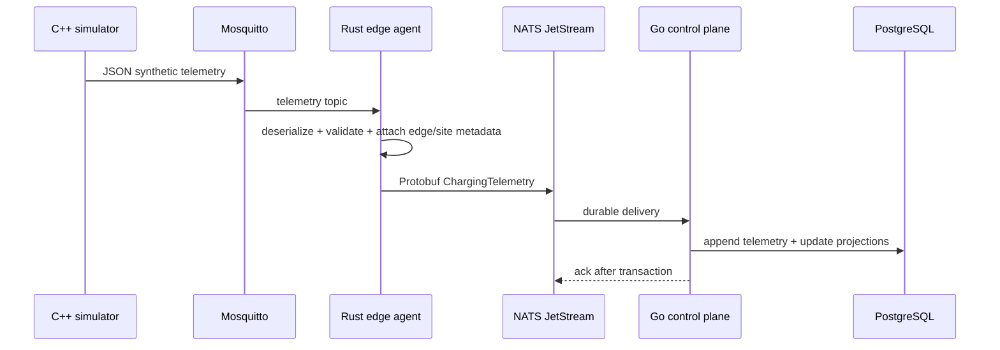

# Telemetry Data Flow

MQTT is intentionally limited to the site-local simulator/edge link. The canonical edge-to-cloud event is a Protobuf payload on `orvolt.telemetry.evse.v1`, retained in the `ORVOLT_TELEMETRY` JetStream stream. The control plane acknowledges only after the PostgreSQL transaction succeeds, producing at-least-once ingestion. The telemetry table is append-only; `connectors` is a last-known-state projection.

Malformed or out-of-range source data is rejected by the edge agent and logged. The current implementation does not persist a dead-letter event, because error retention policy and PII policy are not yet specified.
