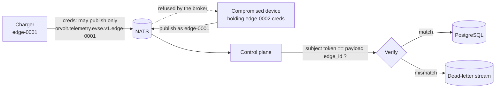

# Device Identity

## The problem

Before this, every publisher on the bus was anonymous. The broker accepted any
connection, and the only statement of *who sent a message* was a field inside
the message. A device that could reach the bus could publish telemetry claiming
to be any station in the fleet, and nothing would notice.

For a charging network that is not a theoretical concern. Chargers sit in public
places on networks the operator does not control, and their telemetry becomes
billing evidence.

## The model

Identity is carried by the **subject**, not by the payload.



Two independent checks, and both must pass:

1. **The broker** decides which subjects a credential may publish to. A charger
   holding `edge-0001`'s credential physically cannot publish to
   `orvolt.telemetry.evse.v1.edge-0002`.
2. **The control plane** compares the authenticated subject token against the
   `edge_id` inside the payload. A mismatch is a permanent rejection and the
   message is parked in the dead-letter stream rather than persisted.

The second check is what catches a device that was issued the right credential
but writes someone else's identity into its own messages. Neither check alone is
sufficient: the broker does not read payloads, and the control plane cannot
authenticate anything on its own.

`REQUIRE_DEVICE_IDENTITY=true` additionally rejects any message that arrives on
the bare base subject — that is, from a publisher that did not identify itself
at all. It is off by default so a development stack works without credentials,
and it must be on for any bus reachable from an untrusted network.

## Provisioning

ORVOLT uses NATS accounts and per-device users. One credential per charger: a
shared credential means one compromised station can impersonate the whole fleet,
and revoking it takes the fleet down with it.

```sh
# One operator account holds the streams.
nsc add account ORVOLT
nsc add user --account ORVOLT control-plane \
  --allow-sub 'orvolt.>' --allow-pub 'orvolt.dlq.>'

# One user per charger, allowed to publish only to its own subject.
nsc add user --account ORVOLT edge-0001 \
  --allow-pub 'orvolt.telemetry.evse.v1.edge-0001' \
  --deny-sub '>'
nsc generate creds --account ORVOLT --name edge-0001 > edge-0001.creds
```

Note `--deny-sub '>'`: a charger publishes, it never subscribes. A device that
cannot subscribe cannot read other stations' telemetry even if it is
compromised.

Install the credential as `/etc/orvolt/edge-agent.creds`, owned by the service
user, mode `0400`, and point `NATS_CREDENTIALS` at it.

## Transport

`NATS_URL` must use `tls://` anywhere outside a bench. `NATS_CA_FILE` pins the
trust root so a charger will not accept a broker presenting some other valid
certificate. Credentials over a plaintext link are credentials in the clear.

## What is still missing

Stated plainly, because a security document that implies more than exists is
worse than none:

- **Provisioning is manual.** There is no enrolment flow, no per-device key
  generation on first boot, and no automated rotation. A fleet of thousands
  needs all three.
- **There is no revocation path in this repository.** NATS supports JWT
  revocation lists; nothing here manages them.
- **The management API is unauthenticated.** Device identity protects the ingest
  path. Anyone who can reach the REST API can still read the fleet. That is the
  next piece of work, and it needs tenancy to be meaningful.
- **The OCPP gateway does not authenticate charge points.** OCPP 1.6J supports
  HTTP Basic auth over TLS and, in the security profiles, client certificates.
  The gateway currently accepts any charge point that connects, and its
  authorization mode governs only whether tokens may start sessions.
- **No hardware root of trust.** Credentials sit on the filesystem. A charger
  with a TPM or secure element should keep its key there instead.
