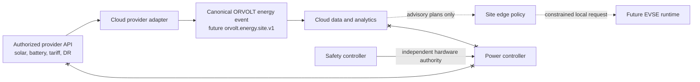

# External Energy Integrations

## Purpose

ORVOLT may use authorized external energy data to improve fleet visibility, forecasting, tariff analysis, and future orchestration. External vendors and utilities are useful information sources, not safety authorities.

## Boundary Rules

- Provider clients run in the cloud integration boundary only. No vendor SDK, access token, or public API client belongs in `firmware/`, `power/`, or the initial edge telemetry agent.
- Initial integrations are read-only. They may ingest energy observations, forecasts, tariffs, and demand-response notifications.
- A future provider command is a cloud-originated proposal, not an electrical command. It requires explicit product scope, owner consent, audit records, local policy, EVSE-runtime mediation, and hardware-enforced limits.
- A provider outage, revoked consent, expired token, rate limit, or incorrect forecast must only reduce optional optimization. It must not stop the EVSE telemetry path or affect protective behavior.
- Provider payloads are never treated as canonical. The adapter records source, retrieval time, asset identity mapping, units, data-quality status, consent scope, and source timestamp before publishing a normalized event.

## Candidate Sources

| Source | Public capability relevant to ORVOLT | Phase status |
| --- | --- | --- |
| Tesla Energy | Authorized energy-site status, history, tariff information, and settings through Fleet API. | Research only; user OAuth and app approval required. |
| Enphase | Authorized solar, consumption, battery, and EV-charger monitoring via OAuth. | Candidate for read-only adapter. |
| SolarEdge | Authorized solar, storage, consumption, alert, and inverter data. | Candidate for read-only adapter. |
| SMA | Monitoring, live data, forecasts, and GridControl APIs; sandbox is available. | Core energy contract, JetStream consumer, persistence, and latest-observation API are implemented. The OAuth client awaits approved sandbox access. |
| OpenADR | Standardized utility/aggregator demand-response programs, events, reports, and subscriptions. | Future standards adapter, not a vendor client. |
| BYD | A public developer platform exists, but this repository has not established a supported, market-appropriate energy or fleet telemetry contract. | Do not implement until a formal partner interface is selected. |

## Delivery Sequence

1. Select one provider and confirm its target market, commercial terms, user-consent flow, data retention, rate limits, and sandbox availability.
2. Add a narrow adapter with OAuth or the provider's approved authorization mechanism, structured logs, health/readiness checks, retry/backoff, and contract tests using recorded sanctioned fixtures.
3. The generated `orvolt.energy.site.v1` contract, `orvolt.energy.site.v1` JetStream subject, cloud projection, migration, and latest-observation API are now in place.
4. Evaluate advisory optimization against simulation before considering locally mediated energy-limit requests.

## Public References

- [Tesla Fleet API energy endpoints](https://developer.tesla.com/docs/fleet-api/endpoints/energy)
- [Enphase API quick start](https://developer-v4.enphase.com/docs/quickstart.html)
- [SolarEdge developer API](https://api-docs.solaredge.com/)
- [SMA Developer Portal](https://developer.sma.de/), including its [sandbox](https://developer.sma.de/sma-sandbox-apis)
- [OpenADR 3 specification overview](https://www.openadr.org/index.php?Itemid=194&catid=20%3Ageneral-site-content&id=210%3Aopenadr-3-0&option=com_content&view=article)
- [BYD developer platform](https://www.byd.auto/addons/cms/document/index)
