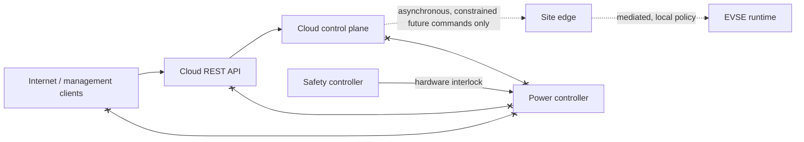

# Security Boundaries

## Non-negotiable paths

- The cloud API is an external-management surface, not an operational control bus.
- A loss of NATS, MQTT, database, or internet connectivity must never remove local protective behavior.
- Future commands require authenticated identities, authorization, auditability, replay protection, local policy, and hardware-enforced limits before any EVSE runtime integration.
- Safety-controller and power-controller interfaces must be electrically and logically isolated from cloud systems.
- Secrets are supplied through environment or a production secret manager; `.env.example` contains development-only values.
- TLS, certificate lifecycle, device identity, and production PKI are deliberately deferred; no encrypted production claim is made by this milestone.
