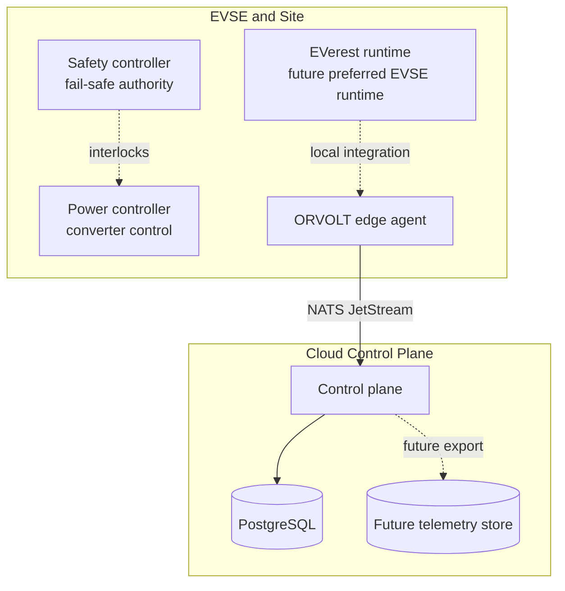

# System Overview

ORVOLT is organized around independently deployable trust and failure domains.

## Ownership

| Domain | Authority | Connectivity requirement |
| --- | --- | --- |
| Safety controller | Protective shutdown, interlocks, watchdog and fault state | None; must fail safe locally. |
| Power controller | Converter limits and low-level power regulation | Local-only, protected by safety interlocks. |
| EVSE runtime | Future charging-session protocol runtime | Site-local. EVerest is preferred over a new implementation. |
| Edge agent | Validate, normalize, buffer/forward observations | Operates locally; cloud loss degrades observability, not safety. |
| Cloud control plane | Persistence, fleet projections and management API | Never safety-critical. |

This repository contains only a synthetic simulator, edge telemetry bridge, and cloud telemetry projection. It contains no physical control logic.

> Software in this repository must not be connected to real high-voltage equipment without appropriate hardware engineering, protection systems, validation, and certification.
